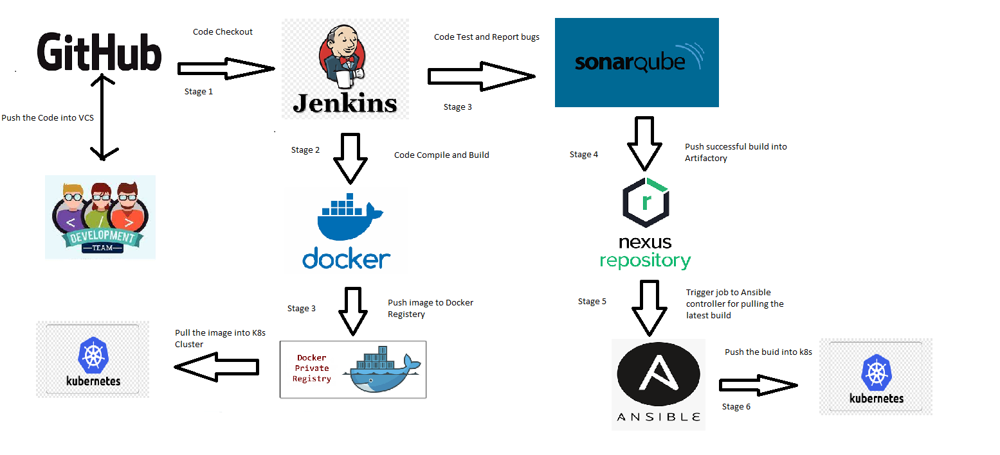
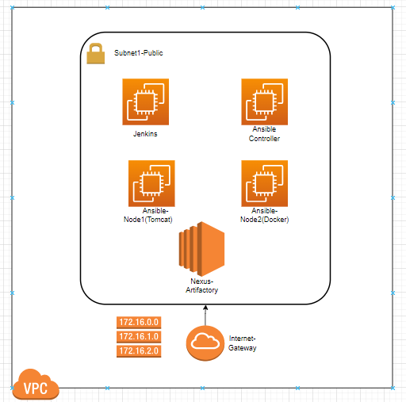

###             My LAB for CI/CD END-END Project

### Project Flow. 
------------------

### TOOLS USED
----------------

* Terraform (IaC) :
     
  * For customised VPC creation using `aws_provider` -- MyLab
  * For requirement instances creation
  * Also instances created using `user_data` for necessary open-source tools installation.

* Ansible :
  
  * For copying code into Docker node
  * For installing tomcat Node
  
### AWS Architecture ###
--------------------

* Day 1 Activity Completed => Created Required Infrastructure in AWS Cloud

